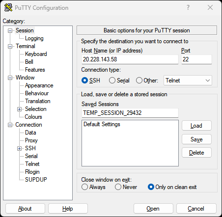

# How to create SSH Tunnel

### What is an SSH Tunnel? <a href="#what-is-an-ssh-tunnel" id="what-is-an-ssh-tunnel"></a>

An SSH tunnel is a method of routing data and information securely over an encrypted SSH (Secure Shell) connection. Imagine it as a secure pipeline through the internet where data can travel safely, away from prying eyes. It's like sending a letter in a sealed, tamper-proof envelope instead of a postcard. SSH tunneling is often used to securely access remote systems, like a server, by creating this protected passageway for data transmission. The tunnel encrypts the data to keep it safe from interception, and only the intended recipient can decrypt and use it.

#### Creating SSH Tunnel on Windows <a href="#creating-ssh-tunnel-on-windows" id="creating-ssh-tunnel-on-windows"></a>

For those utilizing a Windows operating system, we suggest employing [Putty](https://www.chiark.greenend.org.uk/\~sgtatham/putty/latest.html), a widely recognized tool, to manage your SSH sessions effectively.

Open Putty and enter the IP or Host Name for the remote server.

<figure><figcaption></figcaption></figure>

Expand the SSH tab and click on Tunnels.

<figure><figcaption></figcaption></figure>

In the **Source port** is a local port we can select, this number can be anything from 1-65535 as long as its not being used by anything else.

In the **Destination** type in:

```
127.0.0.1:7657
```

* **127.0.0.1**: This is the IP for the localhost running on the remote server, this is also the destination we aim to reach via the SSH server.
* **7657** - This is the destination port, assigned to the I2P console.

Click on **Open** and type in your username and password. If successful you will see the screen below.

<figure><figcaption></figcaption></figure>

#### Creating SSH Tunnel on Linux <a href="#creating-ssh-tunnel-on-linux" id="creating-ssh-tunnel-on-linux"></a>

To create an SSH tunnel on Linux open the terminal.

<figure><figcaption></figcaption></figure>

```
ssh -L 7657:127.0.0.1:7657 i2p@20.228.143.58
```

* **7657** - This is the local port we can select, this number can be anything from 1-65535 as long as its not being used by anything else.
* **127.0.0.1**: This is the IP for the localhost running on the remote server, this is also the destination we aim to reach via the SSH server.
* **7657** - This is the destination port, assigned to the I2P console.
* **i2p -** This is the username used to log into the remote server. This should be different for everyone.
* **20.228.143.58 -** This is the IP of the remote server that I2P is installed on.

#### Creating SSH Tunnel on Mac <a href="#creating-ssh-tunnel-on-mac" id="creating-ssh-tunnel-on-mac"></a>

To create an SSH Tunnel on a Mac open the default Terminal Application.

<figure><figcaption></figcaption></figure>

Enter the following command into the terminal.

```
ssh -L 7657:127.0.0.1:7657 i2p@20.228.143.58
```

* **7657** - This is the local port we can select, this number can be anything from 1-65535 as long as its not being used by anything else.
* **127.0.0.1**: This is the IP for the localhost running on the remote server, this is also the destination we aim to reach via the SSH server.
* **7657** - This is the destination port, assigned to the I2P console.
* **i2p -** This is the username used to log into the remote server. This should be different for everyone.
* **20.228.143.58 -** This is the IP of the remote server that I2P is installed on.
